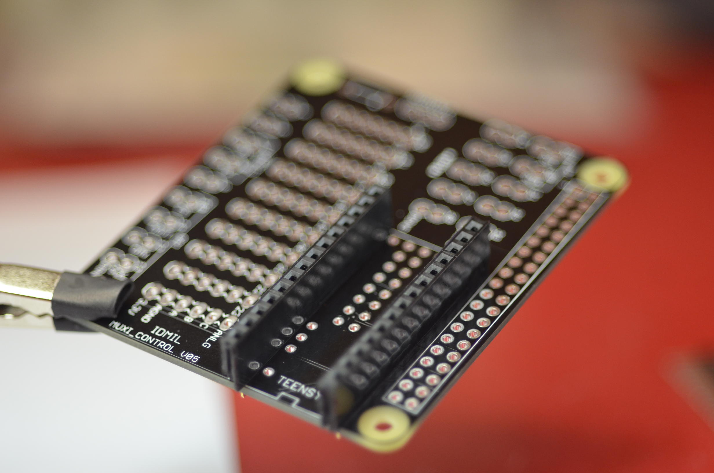
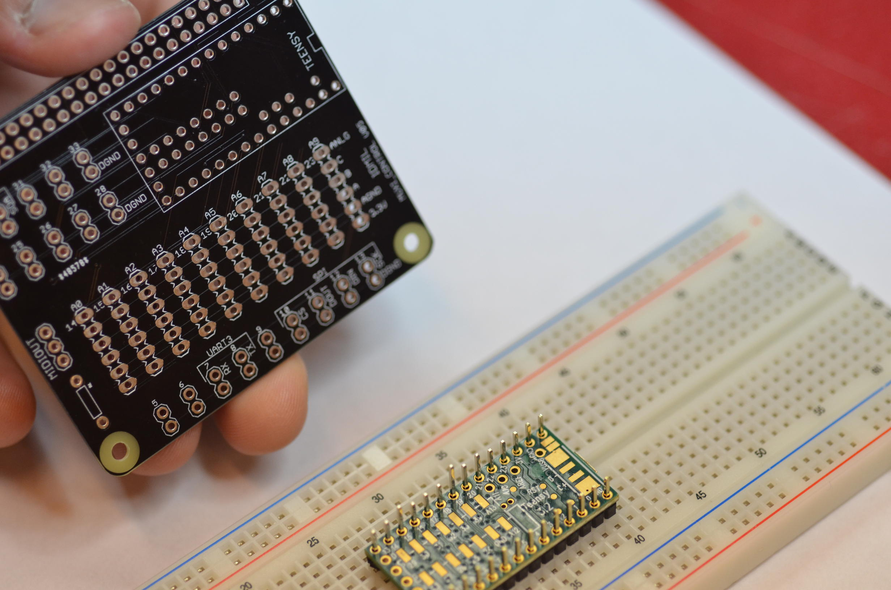
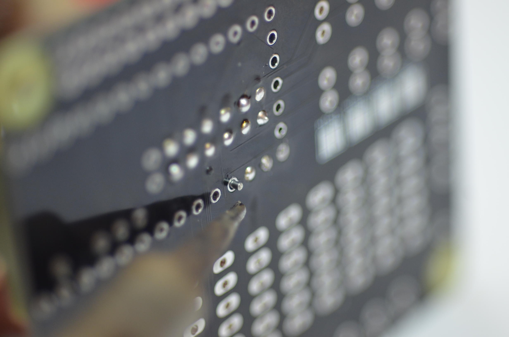
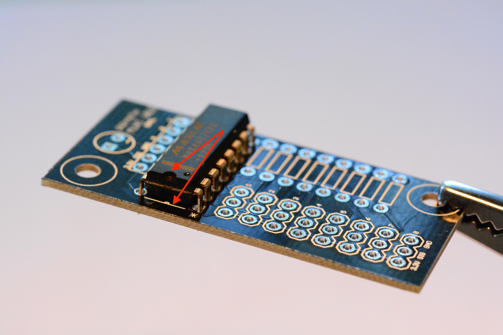
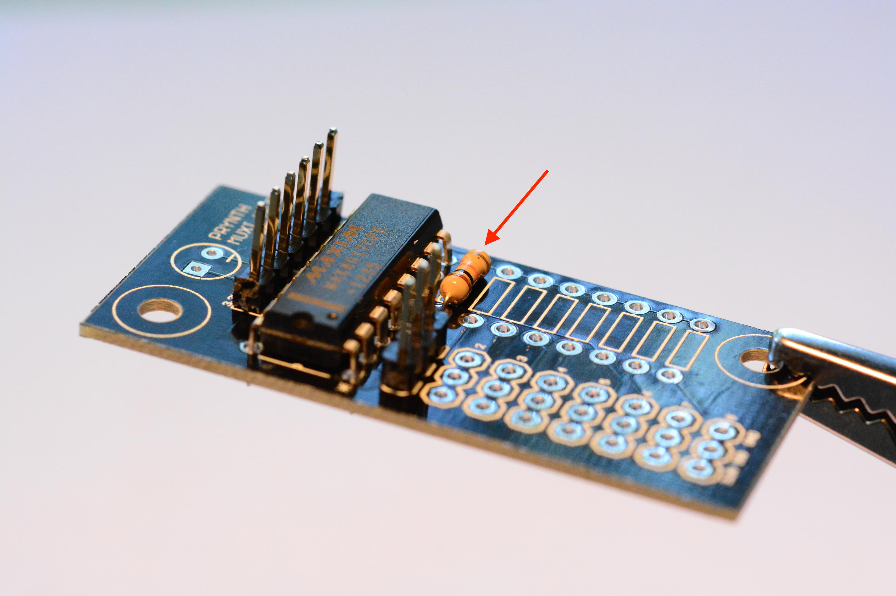

# Assembling the PCBs

This guide contains instructions on how to assemble the Prynth printed-circuit boards. They allow for the direct connection of sensors, like knobs, sliders and buttons, that can be used to create the instrument's physical interface.

The first step is to download the printed-circuit boards designs, distributed as [Eagle and Gerber files](../downloads/). These files can be sent to an online PCB service for manufacturing. Each manufacturer has a particular set of specifications and rules for the design of PCBs. The Prynth boards have been designed conforming to the [Dirty PCBs](http://dirtypcbs.com/) rules, with a 6 mil minimum tracing, which is common to many of these services.

## Requirements

<table style="width:100%; vertical-align: top">
<tr>
	<td valign="bottom">
		Soldering tools
		 
		
	</td>
	<td valign="bottom">
		Female jumper wire
		 
		
	</td>
	<td valign="bottom">
		Prynth Control PCB
		 
		
	</td>
</tr>

<tr>
	<td valign="bottom">
		Muxi PCBs
		 
		
	</td>
	<td valign="bottom">
		Teensy 3.1 or 3.2 micro-controller
		 
		
	</td>
	<td valign="bottom">
		4051-compatible 8-channel analog multiplexer
		 
		
	</td>
</tr>

<tr>
	<td valign="bottom">
		Male and female headers
		 
		
	</td>
	<td valign="bottom">
		2 x 20 GPIO female header with extra-long pins
		 
	
	</td>
	<td valign="bottom">
		 
	</td>
</tr>
</table>

## Prynth Control PCB
The main circuit board in Prynth is the Control PCB. It uses an embedded Teensy 3.2 micro-controller that does sensor signal acquisition and sends the data to the Raspberry Pi via GPIO connection.

1. **Teensy Micro-controller**
The first step in the assembly of the Prynth Control PCB is to mount the Teensy micro-controller on the board. This can be done through three different techniques. Some are more difficult than others, but also provide more features (namely access to I2C). We will describe all of them, ranked from easier to more difficult, and let the user decide which applies best.

	1.1 **Soldering the Teensy using female and male headers**
		 
		Pros: Easy to solder; Teensy can be easily removed.
		 
		Cons: No access to the I2C block;
		 	 
		1.1.1 Solder the male pins to the Teensy.
		
		1.1.2 Solder the female pins to the Muxi Control.
		
		1.1.3 Connect the Teensy to Muxi Control.
		

	1.2 **Soldering the Teensy using only male headers**
		 
		Pros: Easy to solder. Lower height profile.
		 
		Cons: No access to the I2C block; Teensy will be not be removable.
		  

	1.2.1 Solder the male pins to the Teensy.
		
		1.2.2 Place the Teensy on Muxi Control and solder the headers.
		
		1.2.3 Clip extra leads.

	 

	1.3 **Soldering the Teensy directly on the PCB**
		 
		Pros: Access to the I2C block and accompanying digital pins. On the Control PCB, this group of pins are located above the Teensy.
		 
		
		 
		Cons: Difficult to solder (for intermediate/advanced users); Teensy will be not be removable.
		1.3.1 Set two rows of male pins on a breadboard.
		 
		 
		
		1.3.2 Set the Teensy on the pins, turned upside down.
		
		1.3.3 Add a very thin layer of solder on the horizontal pads. Make sure it creates a very thin film. Excess solder could create bumps that can be problematic when seating the Teensy directly on the PCB. Any excess solder can be removed using solder wick. An alternative to the solder film is the application of solder paste or flux.
		
		1.3.4 Set the Control board upside down on the Teensy's pins. Make sure the two boards are aligned, by peeking through the soldering holes. You should be able to see the pads slightly shifted outwards. Make sure the board is secure. If necessary, solder one of the other Teensy pins, but keep in mind you will desolder it afterwards.
		
		
		1.3.5 Flow solder through each of the pins on the central column. The solder will create an air bubble that will eventually escape, creating a solder connection to the underneath pads.
		
		1.3.6 Remove the Control PCB from the breadboard pins. Put some solder wire through each of the remaining pins and apply heat to both sides, creating a soldering bridge.
		
		
		1.3.7 Test connections with a multimeter. If necessary, flow more solder until the connection is established.
		<a id="Note">Note:</a>
		This technique requires some soldering experience. It might be difficult to remove the Teensy after an eventual soldering error. To desolder the Teensy after this procedure, the best bet is the use of a heater plate or a hot air gun.
		Keep in mind that this procedure is only necessary if you want to use I2C digital sensors.

 

2.  **Prynth Control GPIO header**
This female header establishes the connection between the Raspberry Pi and the Control board.

	 

	2.1 Insert the 2 x 20 GPIO female header from the bottom of the board, so that the holes of the female header are facing down and the pins facing up.
	
	2.2 Solder the header from the top of the board.

	<a id="Note">Note:</a>
	If you don't have a 2x20 female header, you can alternatively use two rows of regular female headers. The advantage of the 2x20 female header is that the extra long pins will allow you to continue to extend the Raspberry Pi GPIO pins.

 

3. **Connectors**
	Install male pins according to the required connections (analog, I2C, SPI or digital).

	3.1 Install male pins facing upwards.
	
	3.2 Solder from the bottom of the board.

 

4. **Result**
	Final result (minus MIDI output). My god, it's full of pins!
	

 

5. **Assembly**
	Carefully attach the Control Board to the Raspberry Pi.
	

## Muxi Daughterboards

The 10 analog inputs of Prynth Control can be expanded by connecting up to 10 Muxi daughterboards, offering a total of up to 80 input channels for analog sensors. The Muxi daughterboards are optional. If the intended application uses 10 or less analog sensors, they can be connected directly to Prynth Control. The Muxi daughterboards also includes an optional pull-down resistor for each input, which is convenient for connecting switches and variable resistors.

1. **4051 8-channel analog multiplexer**
	1.1 Take the Muxi PCB and the 8-channel multiplexer.
	
	
	1.2 Position the multiplexer making sure that it is in the right orientation, which can be verified by the small indentation on the chip.
	
	1.3 Solder the multiplexer from the bottom of the board.

 

2. **Connector to Prynth Control**
	2.1 Install a 6 pin header row right in the slot above the 4051.
	
	2.2 Solder the pins.

 

3. **Sensor connectors**
	3.1 Populate the sensor connectors with rows of three male pins.
	
	3.2 Solder the pins.

 

4. **Pulldown resistors**
	Switches and some types of variable resistors need pulldown resistors to form a circuit. On the right of the Muxi boards there is a column to install pulldown resistors, in the same order as the sensors. Assuming the use of 10K variable resistors, a 1K pulldown resistor should be appropriate.

	 

	4.1 Insert the two leads of the resistor.
	
	4.2 Solder from the bottom and clip leads.

 

5. **Result**
	Final result (minus pulldown resistors).
	

 

6. **Assembly**
	Using a 6 pin female header cable, connect the Muxi Daughterboard to Prynth Control. Pay attention to the orientation of the cable. While facing the two boards, the pins have a direct correspondence.
	
