# Assembling the Prynth hardware boards

In this guide you'll find instructions on how to setup your PCB boards. These allow you to easily plug sensors (knobs, sliders, buttons) to create your instrument's physical interface. To get the boards you can [download the Eagle .brd files from the downloads section](../downloads/) and have them manufactured by an online PCB service.

---

# Requirements:

| . Soldering iron                      | |
| . Female jumper wire                  | |
| . MuxiControl PCB                     | [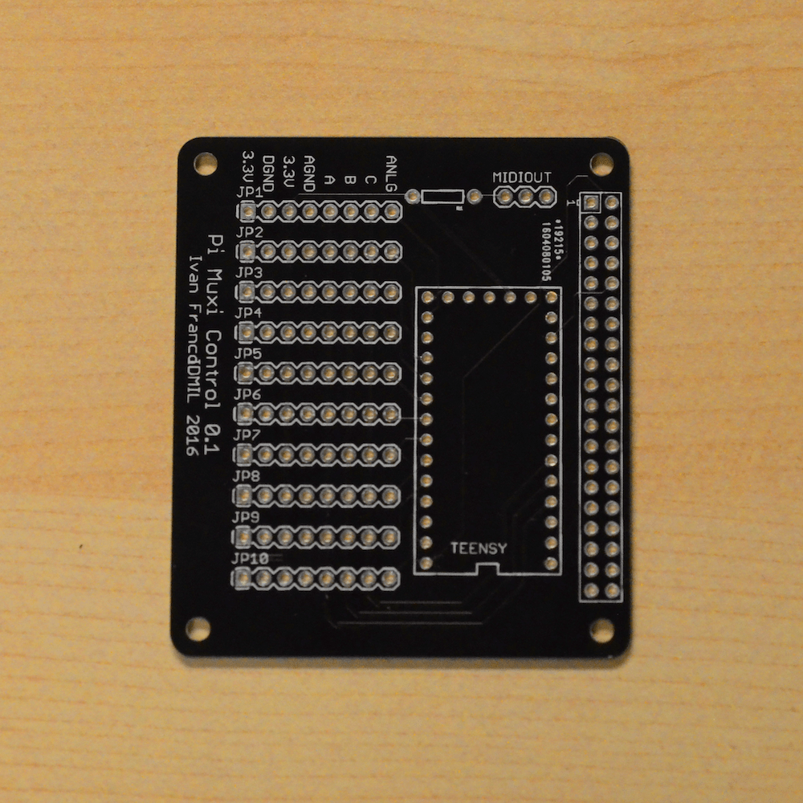{:width="40%" }](../../images/documentation/pimuxicontrol_1.png) |
| . Muxi PCBs                           | [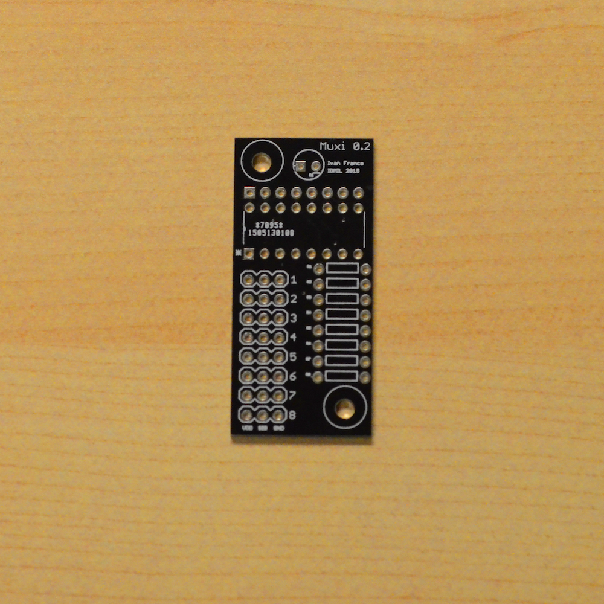{:width="40%" }](../../images/documentation/muxi_1.png) |
| . Teensy microcontroller (3.1 or 3.2) | [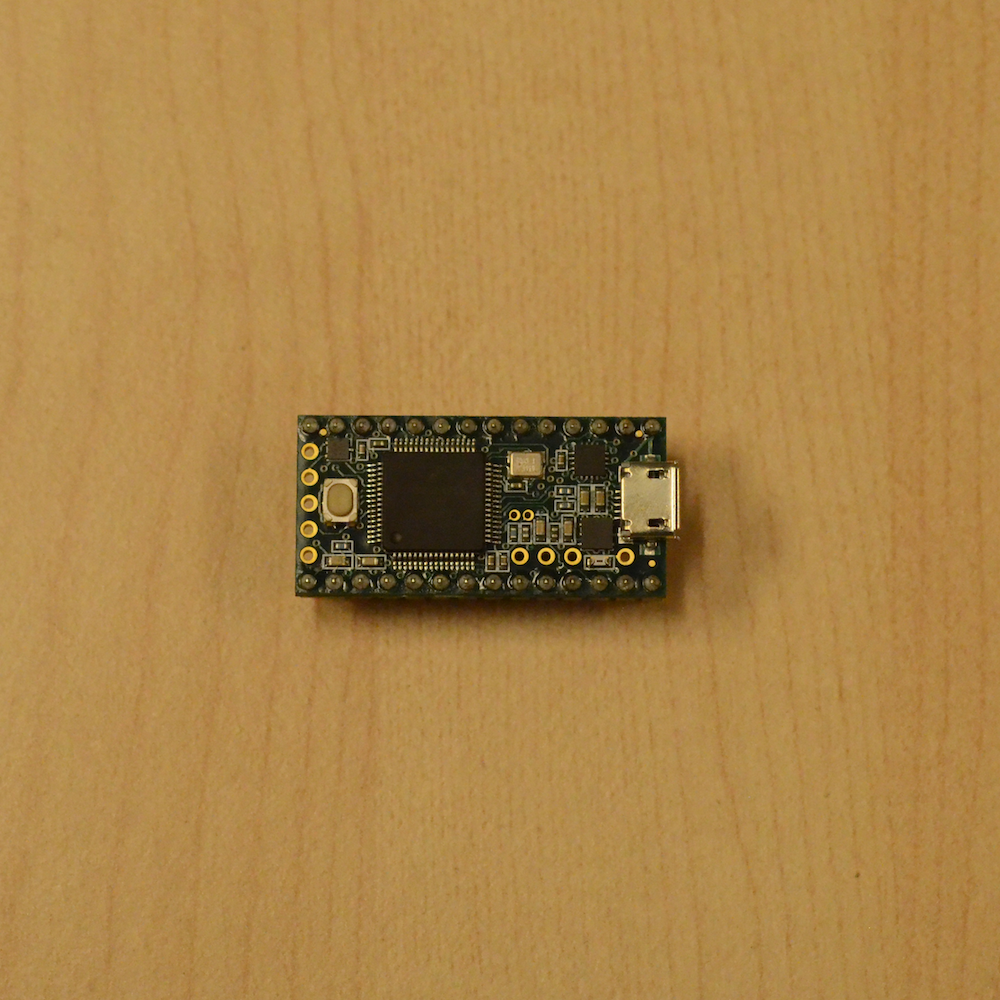{:width="40%" }](../../images/documentation/teensy_1.png) |
| . 4051-compatible 8-channel analog multiplexer   | [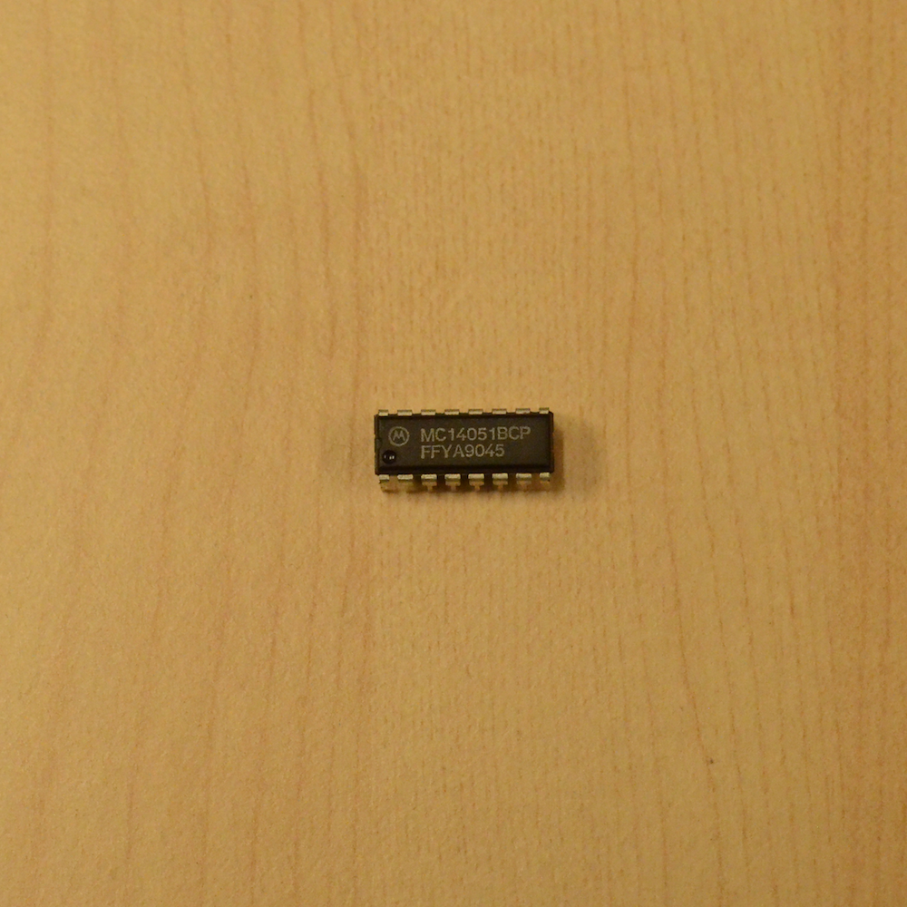{:width="40%" }](../../images/documentation/4051_1.png) |
| . Male and female headers             | [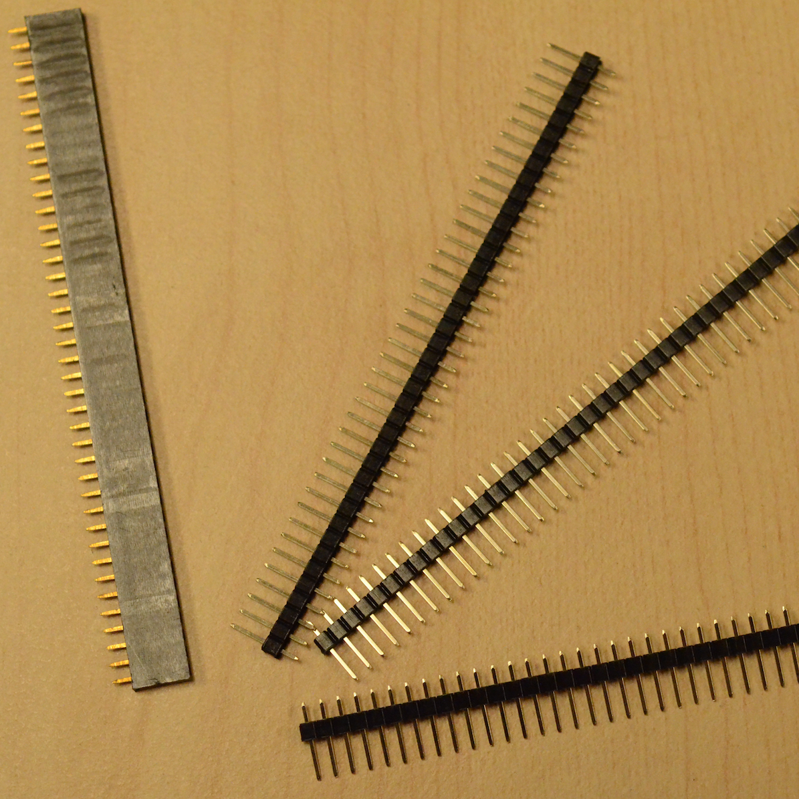{:width="40%" }](../../images/documentation/headers_1.png) |

---

1. First solder the header to the MuxiControl PCB. You can use the Raspberry Pi [2 X 20 GPIO female header](../../images/documentation/rpi_gpio_header.jpg) or just two rows of plain female headers.
The male pins insert from the bottom of the board, so that the holes are facing down.
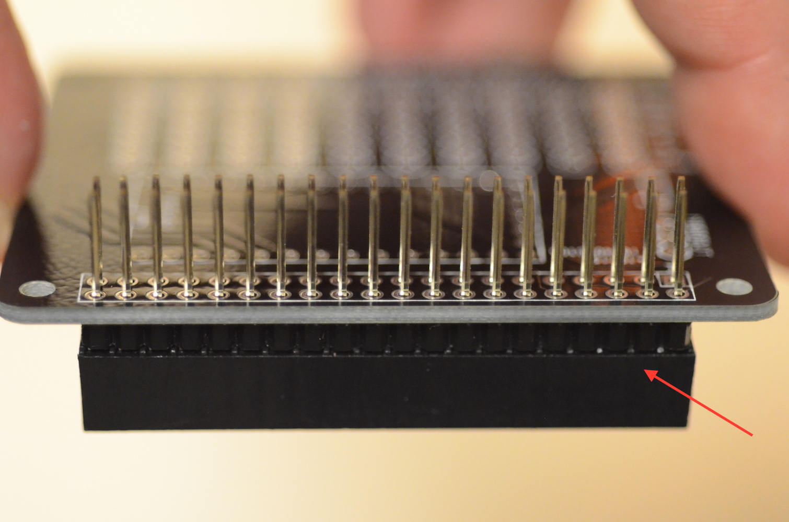

2. Cut two female headers of 14 pins and solder them the other way around, with the holes facing upwards.

3. Finally solder the 10 male 8-pin rows that will connect to the multiplexer boards.
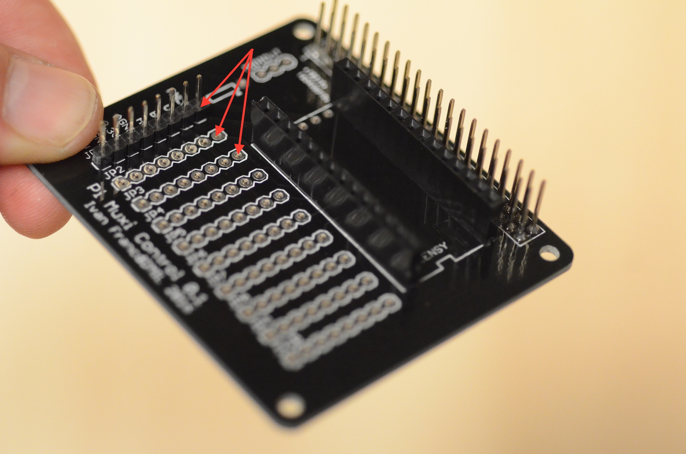

4. Finally solder the male pins to your teensy microcontroller and insert it in the board slot. In the look like the following.
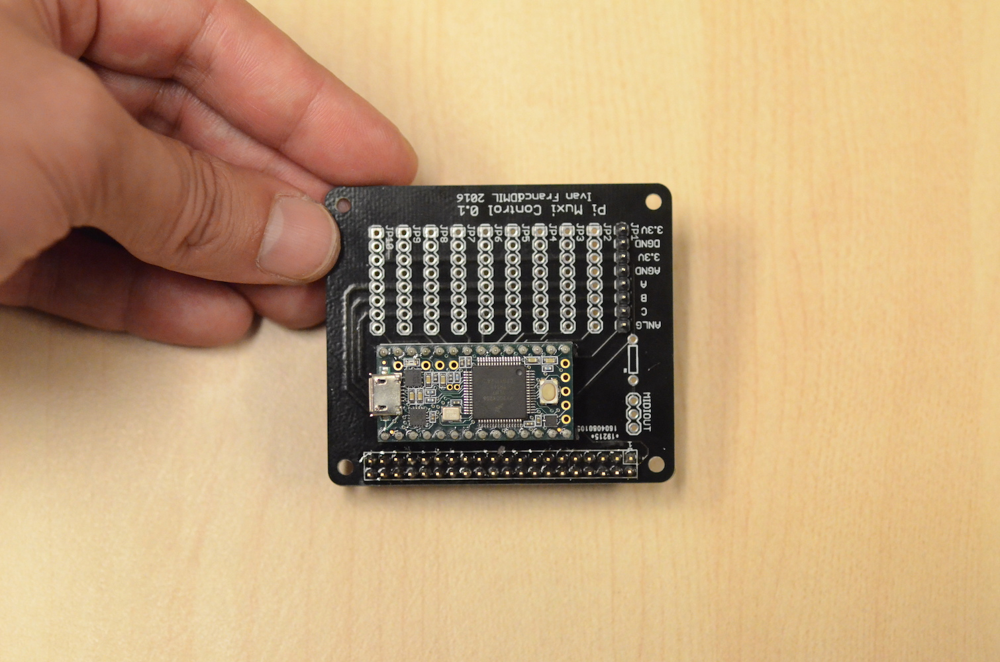

5. Next take your Muxi PCB and your 8-channel multiplexer.
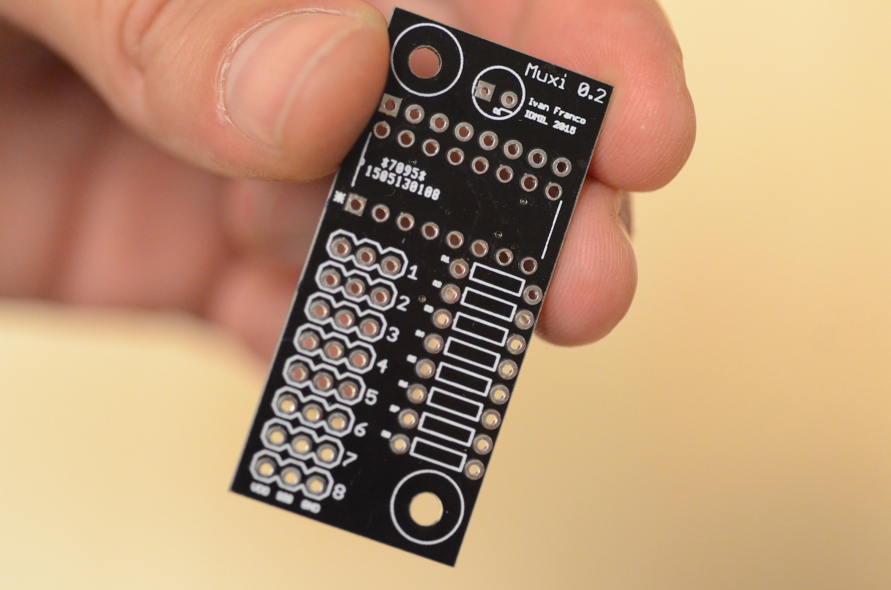
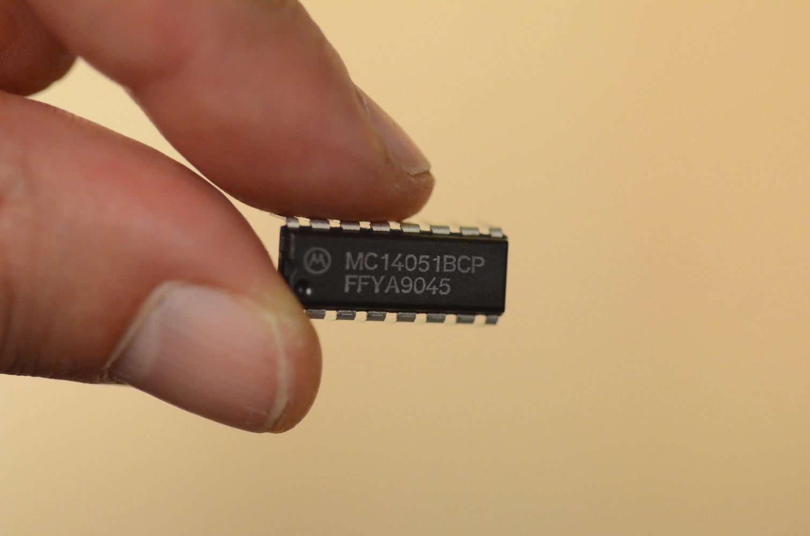

6. Solder the multiplexer to the board making sure that it is in the right orientation, with the orientation guides aligned.

7. Now solder a 8 pin male header on the top of the board and 8 x 3 male pins. You also have the possibility of soldering a pull-down resistor on the right side of the board, in case you need to use switches (eg. buttons) instead of variable resistors.
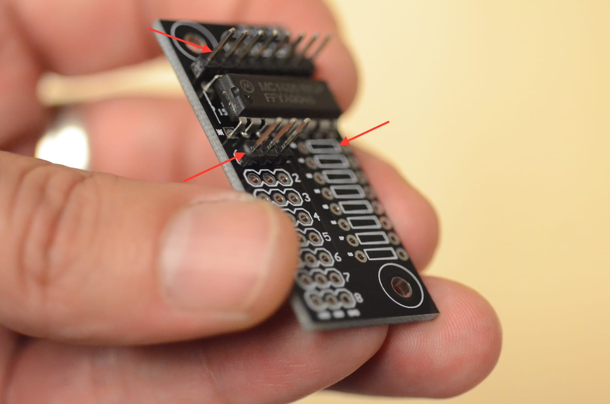

8. You can now connect the two board using female jumper wire, where the pins have the same orientation, like so:

9. Finally connect your variable resistor to the muxi board.
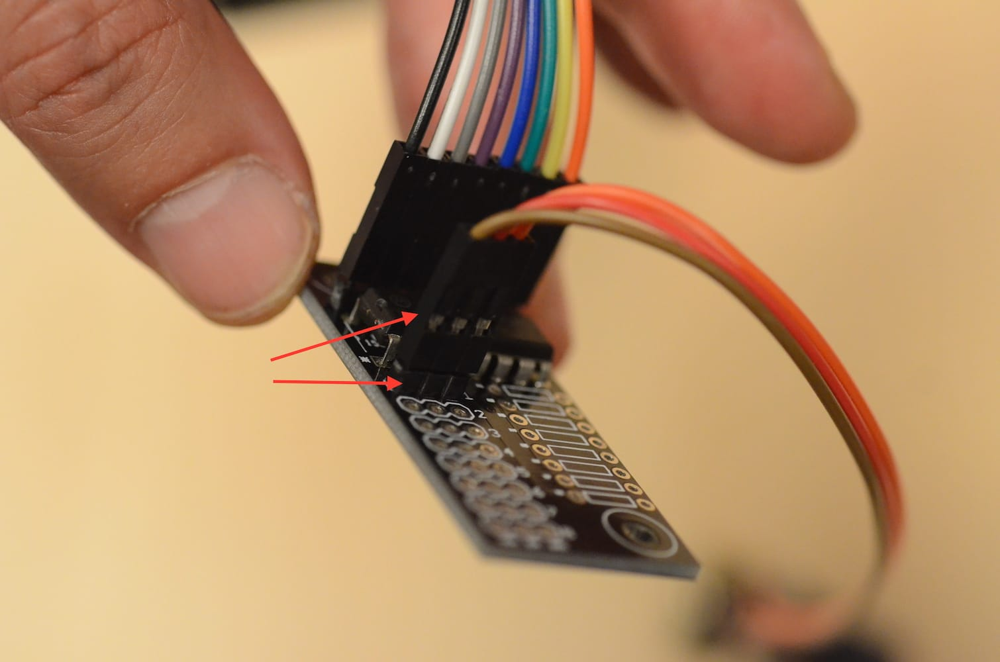

In the end your setup should look similar to this:
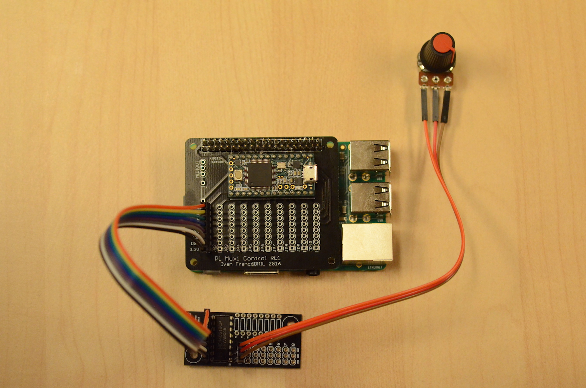

Note: in this example we haven't soldered all of the male pins but you should solder all of them. If you're using less than 10 variable resistors you don't need the multiplexers and you can connect the sensors directly to the muxi control board. You should also ground any inputs that you're not using, in order to avoid ADC acquisition noise.
