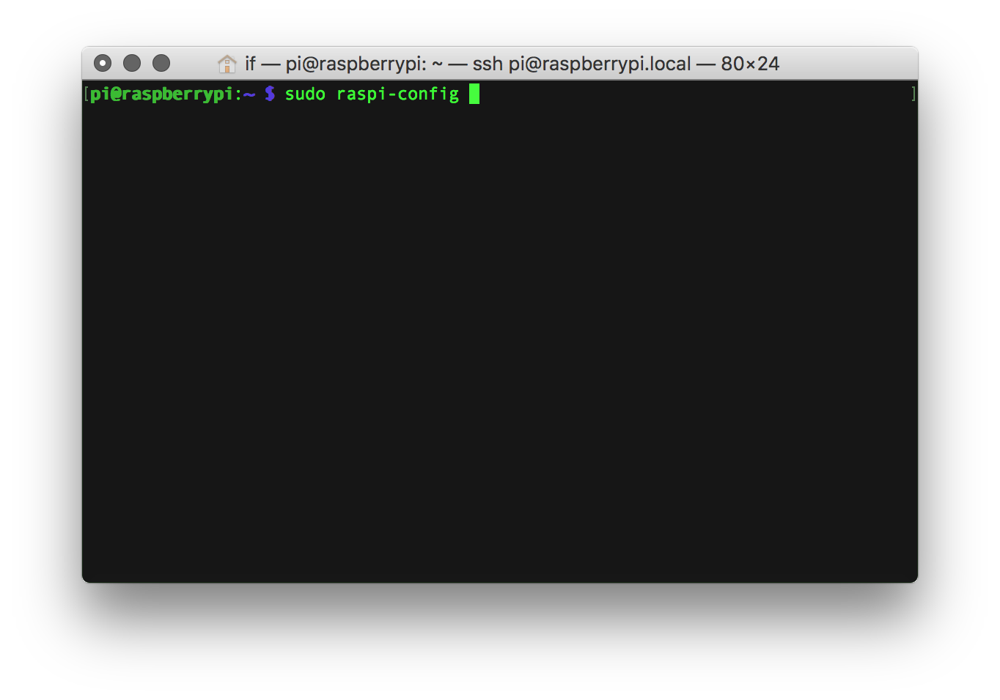
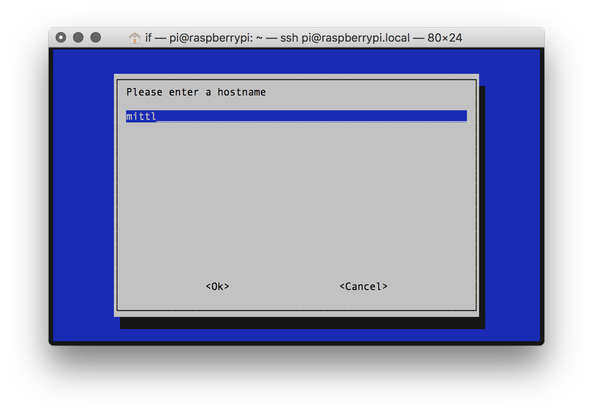

# Changing the hostname of your instrument
Instead of using the default hostname "raspberrypi", you can name your synth anything you want. After that your prynth editor will be reached using a unique name (eg. https://mysynth.local:3000). This is also useful to avoid name clashing, if you have more than one prynth instrument.

1. To do so, you first need to [log into your Raspberry Pi using SSH](ssh-intro.html) and then use the raspi-config program, by typing.
~~~
sudo raspi-config.
~~~

2. Choose option 7 "Advanced Options" and then option A2 "Hostname"

3. After that you will be greeted with some rules about naming convention, after which you can introduce your new hostname.

4. After rebooting your Prynth you should be start using the new hostname.
