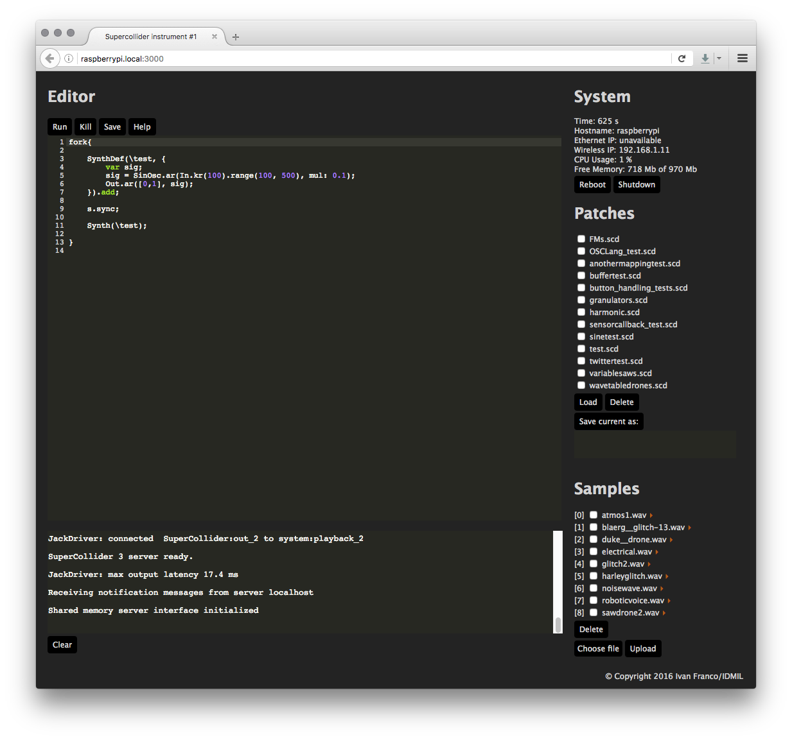
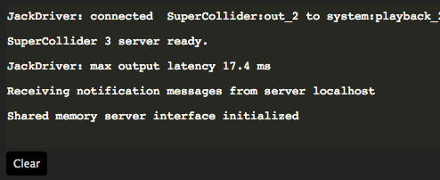
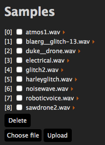

# Introduction to the Prynth code editor

In this guide you'll find instructions on how to get started with the SuperCollider editor that runs automatically on the Prynth distribution. With the editor you'll be able to not only create new synthesis and mapping programs, but also manage files, consult system stats and execute different operations like launching help files or rebooting the instruments.

---

# Accessing the editor

As long as your instrument is connected to the same network as your computer, tablet or pc you'll be able to access the code editor by visiting the following address:

[http://raspberrypi.local:3000](http://raspberrypi.local:3000)

This should return you a webpage that should look like this:

The easiest way to initially connect your instrument to the network is to do it physically via Ethernet cable. Only then will you be able to set your WIFI credentials to have the instrument log to your network wirelessly and every time it's booted.

---

# Overview

All of the current functions of the editor are somehow self-explanatory. The left is occupied mainly by the textual code editor, several buttons for functions like "run", "kill", "save" and "help" and down at the bottom sits a debug window, which will output SuperCollider log messages for feedback.

On the right you'll find several system functions and informative panels. The first is a status report with a uptime clock, current hostname, connected IPs and system load.

[{: .align-center}](../../images/documentation/editor_detail_3.png)

Down to this is a preset panel, in which you can manage your programs and finally a similar file manager but for sound samples.

 

# Editor features

Although this is not a full SuperCollider IDE, it contains features such as code highlighting, code block matching and line numbering and you can write full SuperCollider programs with no specific restrictions.

The most notable difference is that SuperCollider can execute new instructions in a just-in-time fashion, a relevant functionality that is still currently unavailable in the Prynth editor. Instead, every time you push "Run", the SuperCollider application with fully restart, executing your more recently written program. We are still looking into ways of injecting the code at runtime, which should be theoretically achievable.

Another important detail is that the patch manager works mostly as a preset manager. This means that when you hit "run" or "save" on editor buttons you are referring to the program written on the editor window. If you want to manage "screenshots" of programs you should use the appropriate buttons on the patch manager to the right side. The two systems are intentionally kept separate for operational and security reasons, with web processes isolated from the main synthesis process. After running or saving a new program on the editor, this same program will automatically load and run the next time you turn on your system.

The Sample section allows you to upload new sounds to be used in your patches. The samples are numbered, so that you can access them easily inside SuperCollider. For more information on this please consult [writing our first SuperCollider program](first-program.html). The samples also have a small play button to their right, so you can preview the sounds directly on the browser. To upload new files click "Choose file", followed by "Upload". Once the upload is done the file should appear listed.

There are still several planned improvements but the current iteration already represents the minimal functionalities needed to setup an instrument. Stay tuned for the upcoming versions which will implement new features.
