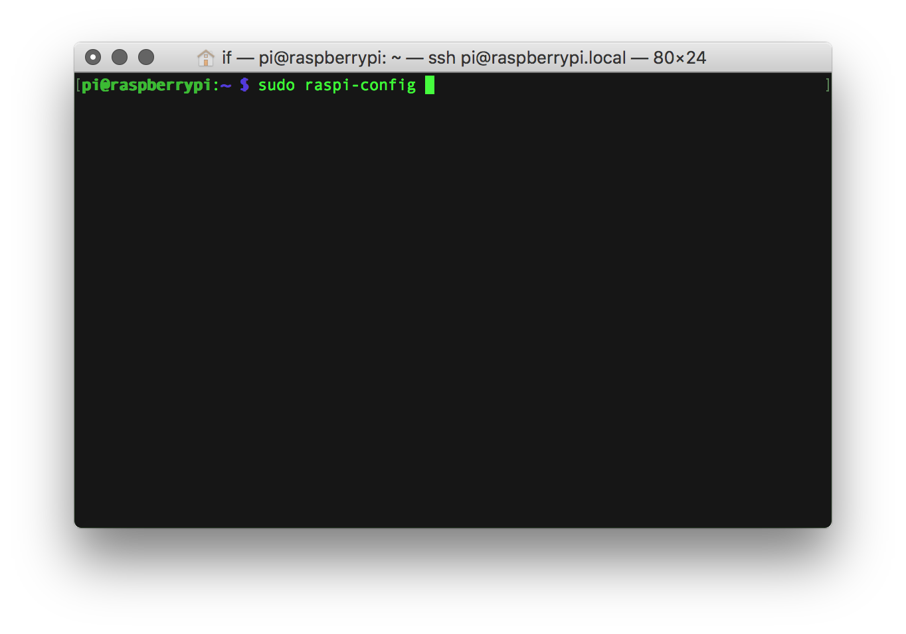
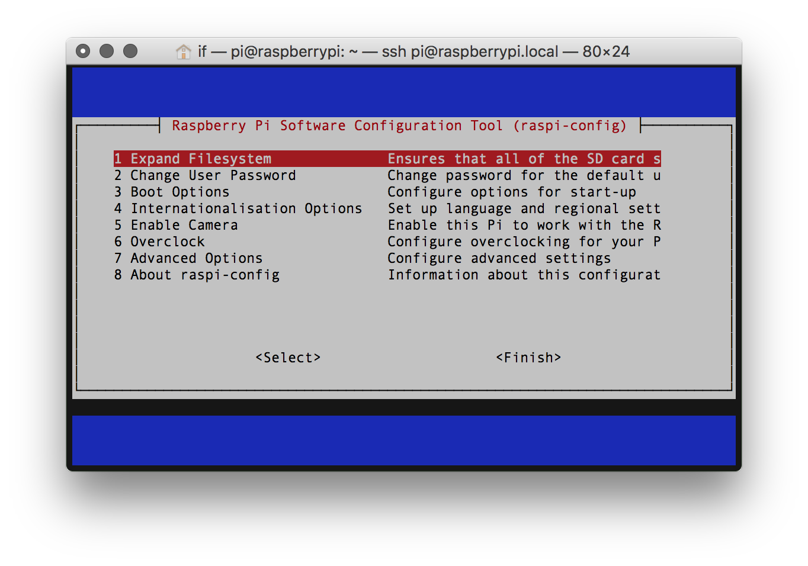
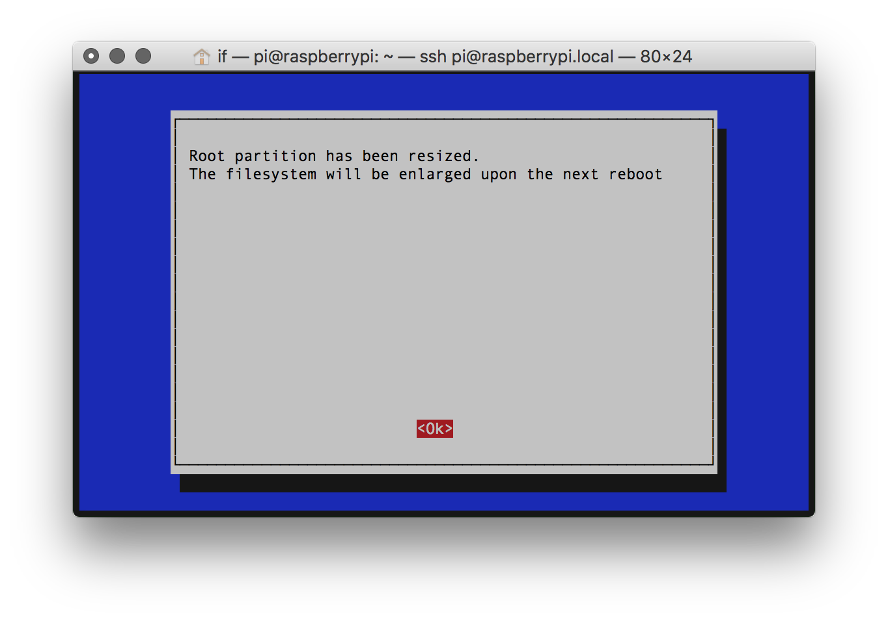

# Expanding the SD card installation

After the [installation of the Prynth Linux image](/create/documentation/install-rpi-image.html) on the SD Card, you will need to expand the filesystem so that you can use all of the space available in your SD Card.

1. To do so, you first need to [log into your Raspberry Pi using SSH](ssh-intro.html) and then use the raspi-config program, by typing.
~~~
sudo raspi-config.
~~~

2. Raspi-config will run and you'll see the following screen. Using the cursor arrow keys on you keyboard select option 1 "Expand Filesystem"

3. Wait a moment and you should then see a confirmation that your root partition has been resized, which will be operational after your next reboot.

