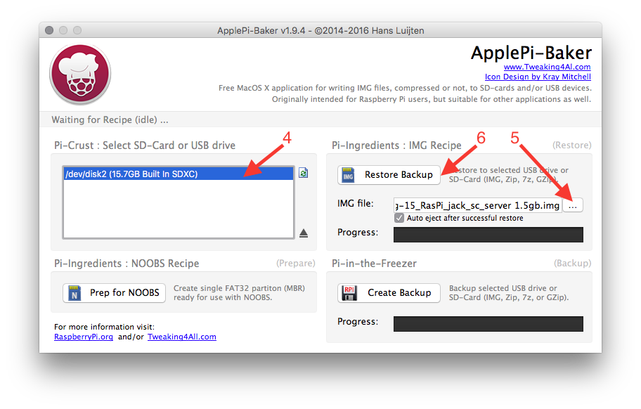
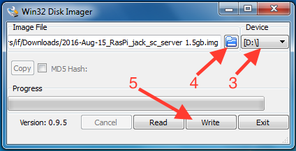

# Installing the Raspberry Pi image

In this guide you'll find instructions on how to setup the Raspberry Pi image which ships  with all the Prynth services, such as the SuperCollider code editor, used to write new synthesis programs. First you need to [download the Prynth Raspberry Pi from the downloads section](../downloads/), after which you'll be ready to burn it to a micro SD Card. Once inserted in the Raspberry Pi, Prynth will automatically boot.

The process is the same as the installation of the official Raspberry Pi images, so there are several other possible methods found on the internet. In order to keep the process the simplest possible we've based these guides on easy-to-use free software.

WARNING: you should be careful in this step, since a wrong procedure could result in the erasing of the hard disk on your computer, so please read/think twice before pressing buttons. If you have doubts consult the internet, where there are hundreds of cookbooks on this subject.
{: .notice--warning}

---

# Requirements:

| . PC or MAC with a SD Card slot. | [{:width="40%" }](../../images/documentation/sd_card_slot.jpg) |
| . Prynth Raspberry Pi Image file. | [download](#link)|
| . Micro SD Card (with with recommended size of at least 8 Gb) | [{:width="40%" }](../../images/documentation/micro_sd_card.jpg) |
| . SD Card adapter | [{:width="40%" }](../../images/documentation/sd_card_adapter.jpg) |

Now select your operating system:
[Mac](#mac) / [Win](#win) / [Linux](#linux)

---

<a id="mac" >Mac</a>

1. Download and install [pi_baker_site](http://www.tweaking4all.com/software/macosx-software/macosx-apple-pi-baker/) (by Hans Luijten).

2. Download and unzip the Prynth Raspberry Pi image file.

3. Insert your micro SD Card in your Macintosh.

4. Open Apple Pi Baker. You should see your SD Card listed on the left.

5. Select the Prynth image from its location on your computer.

6. Click "Restore Backup".

7. When the process is over you can take your micro SD Card and insert it in your Raspberry Pi. When booted the Raspberry Pi should automatically start the Prynth services(check the [notes](#notes) at the end of this tutorial).

---

<a id="win" >Windows</a>

1. Download and install [Win32 Disk Imager](https://sourceforge.net/projects/win32diskimager/).

2. Download and unzip the Prynth Raspberry Pi image file.

3. Insert your micro SD Card in your and check which drive letter is assigned (in the example image it's "D:"). Select the same drive letter on Win32 Disk Imager. Be careful not to choose the wrong drive, as it could result in erasing your hard disk.

4. Select the Prynth image on Win32 Disk Imager

5. Finally write the image by clicking the "write" button.

---

<a id="linux" >Linux</a>

##soon##

---

<a id="Notes">Notes</a>

 We've concentrated on keeping this image as close as possible to the original distribution, so you can use all the typical manuals and how-to's found on the internet.

We've also kept the default RPi username, password and hostname. To access the Prynth webservice:

1. Make sure your RPi is connected to your network.

2. Open your browser at [http://raspberrypi.local:4000](http://raspberrypi.local:4000) and the SuperCollider editor should be loaded without any further intervention.
