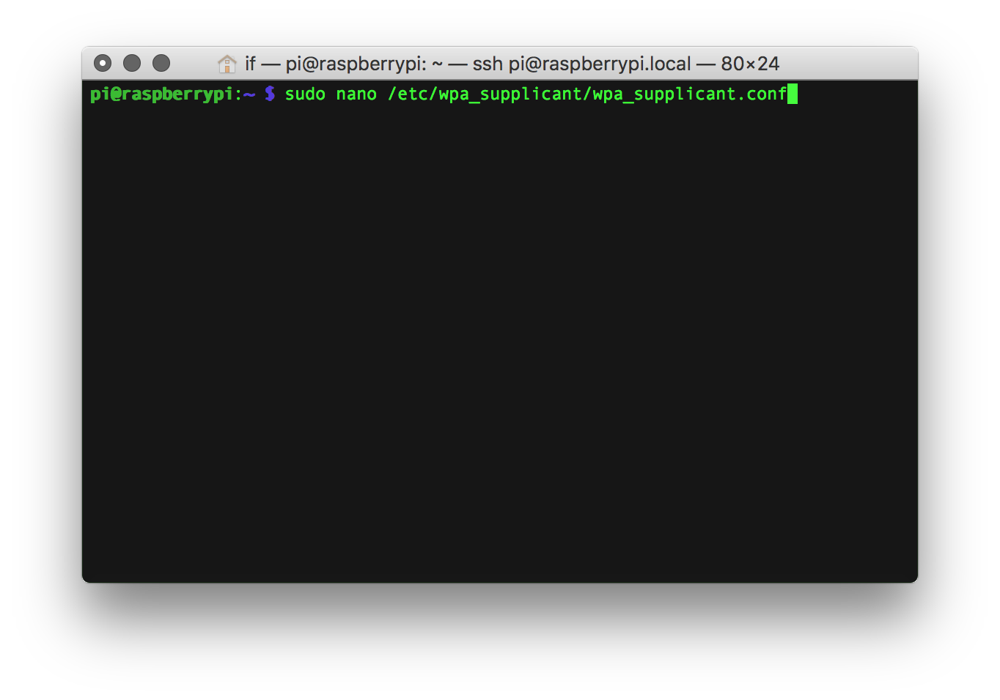

# Connecting to your local wireless network
The first time you boot your Prynth it will try to connect to a network via Ethernet or the first WiFi it finds that doesn't require a password. This is useful for a first setup, but you should change this default behavior or you might end up connected to some unknown network.
To setup your own wifi you need to:

1.[Log into your Raspberry Pi using SSH](ssh-intro.html) and then type:
~~~
sudo nano /etc/wpa_supplicant/wpa_supplicant.conf
~~~

2. This will take you to a text editor, through which you should write your network name and password, using the following format and substituting "mynetwork" and "my password" for your own.
~~~
network={
        ssid="mynetwork"
        psk="mypassword"
}
~~~
3. Next comment the other network entry by adding numeral signs in front of each line. It should look similar to this:

4. Finally to save and exit by pressing Ctrl+x and typing "y" for yes.

