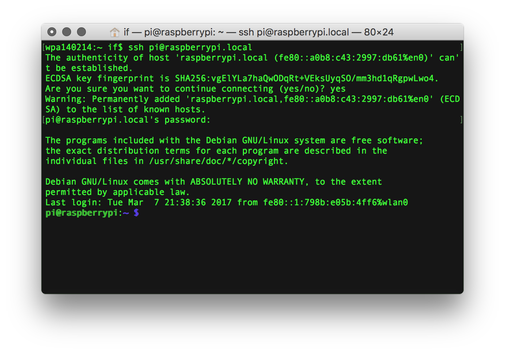

# Logging to the Raspberry Pi via SSH session
To connect to your Raspberry Pi using the command line you should use a secure shell session (SSH).

1. To do so open your Terminal program and write:
~~~
ssh pi@raspberrypi.local
~~~

2. On some systems you might be greeted with a message saying that your host (the raspberry) can't be authenticated and asking if you want to proceed. Ignore this and answer "yes".

3. Next you will be asked for your password. The default password is the same as in the original Raspbian distribution, which is "pi". After proceeding you should be logged to your pi, which can be confirmed by the prompt with "pi@raspberrypi".

