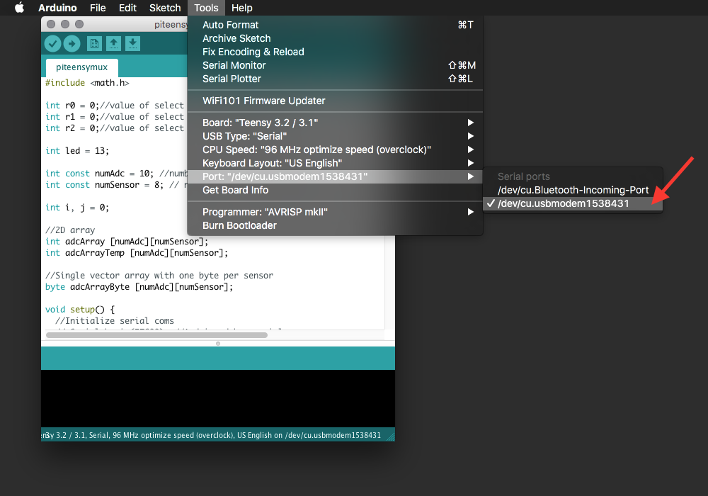
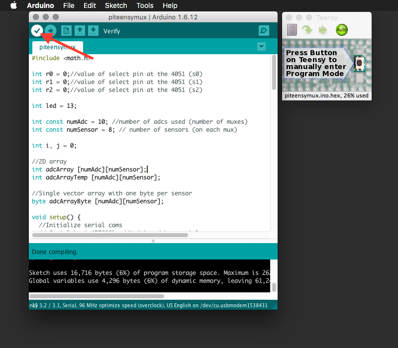
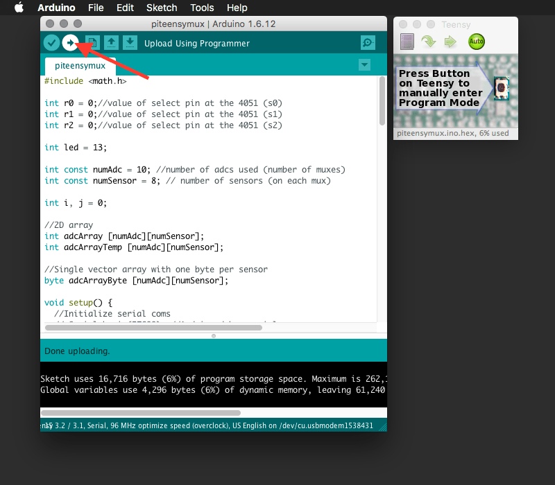

# Uploading the Teensy firmware

This guide will show you how to upload the SCDMI Teensy program to the Pi Muxi Control board.
To proceeed make sure you've completed the steps described on the [Pi Muxi Control board assembly](board-assembly.html).

---

# Requirements:

| . PC or MAC with a USB connection | [{:width="40%" }](../../images/documentation/usb_slot.jpg) |
| . Teensy firmware program. | [download](#link) |
| . Micro-B USB to USB cable | [{:width="40%" }](../../images/documentation/micro_usb_plug.jpg) |

---

<a id="mac" >Mac</a>

1. Download and install the [Arduino IDE](https://www.arduino.cc/en/Main/Software).

3. Open Arduino the Arduino IDE and close it again (so it is initialized before step 3).

3. Download and install the [Teensyduino software]. Note: at the time of writing the current Teensyduino is not supported by the latest Arduino IDE (1.6.12), unless you use [this beta version](https://forum.pjrc.com/threads/37204-Teensyduino-1-31-Beta-1-Available). Once the official Teensyduino 1.31 is released it should appear in the regular downloads location.

4. Download the [SCDMI Teensy firmware](#link).

5. Connect your SCDMI board / Teensy to your computer.

6. Launch the Arduino IDE software and open the SCMDI Teensy Firmware project.

7. Choose Teensy 3.1 / 3.2 as the target board on the Arduino IDE menu.

8. Choose the programming serial port on the Arduino IDE menu.

9. Verify that the program is correct and contains no errors by clicking the "verify" button on the Arduino IDE.

10. Finally upload your program by clicking the upload button on the Arduino IDE. This should launch an additional Teensy window that will report success or failure and automatically reboot the Teensy once the program is uploaded.

